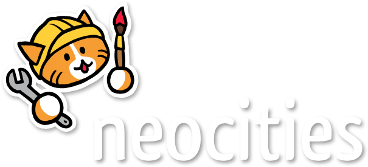

ESTE É UM TEXTO 

MAIS UM TEXTO 

# ola 



## NIVEL 2
- oi
- ola


# NIVEL 3 
<button> oi na minha casa </button>


ESTE AQUI É UM DESTAQUE DE TEXTO

> **E AQUI VAI O TEXTO A SER DESTACADO. ELE PODE SER UM PARAGRAFO INTEIRO.**
 
> OI

♾️

😂✍

``` javascript

let nome = "gustavo"
console.log(nome)

function BahQueTri() {
    console.log("bah" .repeat(20))
    console.log("tri")
}
```


# BEM VINDO AO MEU MUNDO.

